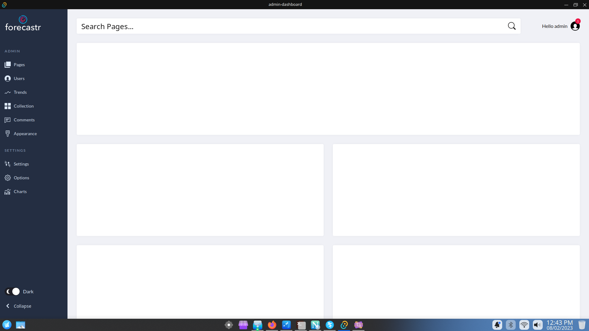

# Admin dashboard

A deskop app admin dashboard using tauri.
Currntly with no functionality just UI.
Origin UI by [tutsplus](https://codepen.io/tutsplus/pen/gOObdjQ)

# Screen


# Building
1. Install dependencies
   1. [rust](https://www.rust-lang.org/tools/install)
   2. [cargo](https://www.rust-lang.org/tools/install)
   3. [tauri-cli](https://crates.io/crates/tauri-cli)
2. Run the following cmd in project directory
```bash
cargo tauri build
```

# Run
To start the application run 
```bash
./src-tauri/target/release/admin-dashboard
```

# Optimization (Bin size)
1. Use [`unsed-features analyze`](https://lib.rs/crates/cargo-unused-features) before compile
2. Use `UPX` on the bin after compile
      ```bash
      upx --best --lzma src-tauri/target/release/admin-dashboard
      ```
# Check CPU/Mem usage
Install `sysstat` and run 
```bash
watch pidstat --human -C "admin-dashboard" -r -p ALL
```
Note: This doen't capture resource usage for WebView